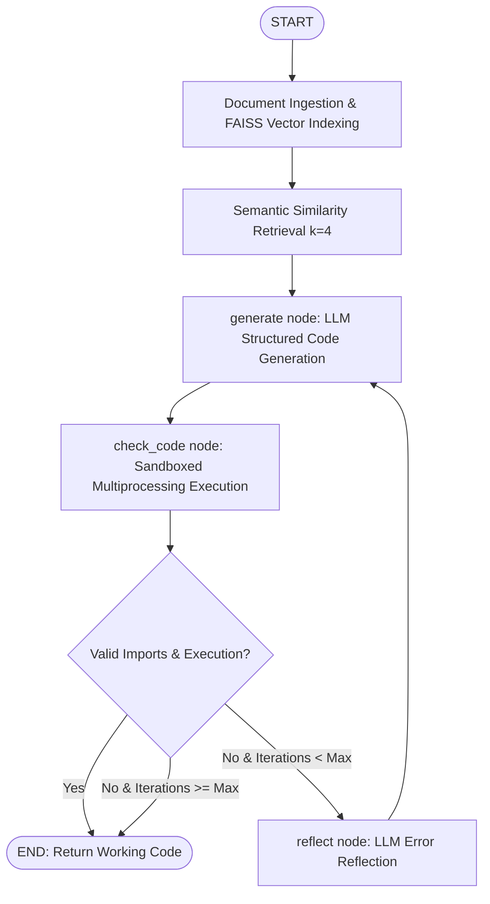

# 🤖 LangGraph Code Assistant

A state-of-the-art Python code generation system built with **LangGraph**, **FAISS Vector RAG**, and **OpenAI GPT Models**. Implements the **AlphaCodium self-correction paradigm**, automatically testing candidate Python code, capturing runtime tracebacks, generating LLM error reflections, and self-healing solutions in sandboxed execution runtimes.

---

## 🚀 Key Features

- **LangGraph State Machine**: Stateful cyclical AI workflow managing conversation history, generation schema, iteration counts, and error states.
- **FAISS Vector Indexing & RAG**: Chunks web documentation via `RecursiveCharacterTextSplitter` and indexes embeddings with `FAISS` for semantic similarity retrieval ($k=4$).
- **Structured Pydantic Output**: Enforces strict JSON schemas (`prefix`, `imports`, `code`) via OpenAI Function Calling.
- **Sandboxed Execution & Timeouts**: Runs dynamic code validation in isolated child processes with a 5-second timeout limit to prevent host process crashes or infinite loops.
- **LLM Error Reflection Node**: Dedicated reflection node (`_reflect`) that analyzes execution tracebacks and generates targeted fix strategies before code re-generation.
- **LangSmith MLOps & Benchmarking**: Full tracing and automated programmatic dataset evaluation framework.
- **Web UI & CLI**: Clean **Gradio** web app and feature-packed Command Line Interface.

---

## 🏗️ Architecture



---

## 📋 Prerequisites

- **Python**: 3.8+
- **OpenAI API Key**: Set `OPENAI_API_KEY` in your `.env` file
- **(Optional) LangSmith API Key**: Set `LANGCHAIN_API_KEY` for evaluation & tracing

---

## 🛠️ Quick Start

### 1. Clone & Setup Virtual Environment

```bash
git clone https://github.com/akshatkhedia/code-assistant.git
cd code-assistant

# Create virtual environment
python3 -m venv .venv
source .venv/bin/activate  # On Windows: .venv\Scripts\activate

# Install dependencies
pip install -r requirements.txt
```

### 2. Configure Environment Variables

Create a `.env` file in the project root:

```env
# Required
OPENAI_API_KEY=your_openai_api_key_here

# Optional: LangSmith Tracing & Observability
# LANGCHAIN_API_KEY=your_langsmith_api_key
# LANGCHAIN_TRACING_V2=true
# LANGCHAIN_PROJECT=langgraph-code-assistant

# Optional: Defaults
DEFAULT_MODEL=gpt-4o-mini
MAX_ITERATIONS=3
REFLECTION_MODE=reflect
```

---

## 💻 Usage

### Web Interface (Gradio)

Launch the interactive web application:

```bash
python app_gradio.py
```

Open your browser at `http://localhost:7860`. The app will automatically build the FAISS vector index and allow you to configure models (`gpt-4o-mini`, `gpt-4o`, `gpt-3.5-turbo`), adjust max iterations, and inspect code output alongside validation errors.

### Command Line Interface (CLI)

Run single-query generation directly from your terminal:

```bash
# Basic usage
python -m src.main "How do I build a RAG chain in LCEL?"

# Verbose output with custom model
python -m src.main "How do I create a custom runnable?" \
    --model "gpt-4o" \
    --max-iterations 3 \
    --verbose
```

---

## 📊 Evaluation & Benchmarking

Run the built-in LangSmith evaluator to score code solutions against test datasets:

```python
from src.evaluator import CodeEvaluator
from src.langgraph_workflow import LangGraphCodeAssistant

evaluator = CodeEvaluator()
# Evaluates import check and runtime execution success rates
```

---

## 📁 Repository Structure

```text
├── app_gradio.py          # Gradio Web UI entry point
├── render.yaml            # Render.com deployment configuration
├── requirements.txt       # Python dependency specifications
├── example_questions.txt  # 50 benchmark coding questions
└── src/
    ├── config.py          # Environment configuration & tracing setup
    ├── models.py          # Pydantic schema (CodeSolution) & GraphState
    ├── document_loader.py # FAISS vector store creation & document chunking
    ├── code_generator.py  # LLM chain, sandboxed execution & reflection chain
    ├── langgraph_workflow.py # LangGraph StateGraph & node logic
    ├── evaluator.py       # LangSmith benchmarking suite
    └── main.py            # CLI entry point
```